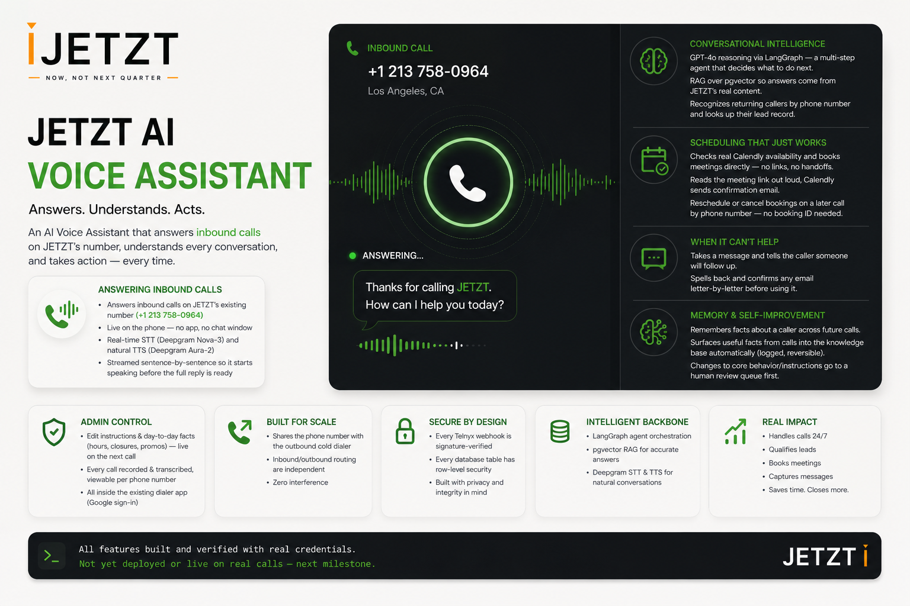

# JETZT Voice Agent — backend

Inbound AI voice agent for JETZT. Answers calls to the existing number
(`+1 (213) 758-0964`, shared with the outbound cold dialer — see
`docs/what-already-done-in-dialer.md`), runs Telnyx Call Control + Media
Streaming into Deepgram STT → LangGraph (GPT-4o + tools) → Deepgram TTS.
Full design in `docs/voice-agent-plan.md`.

**Repo relationship to the dialer:** two separate repos, two separate
Vercel deployments — this one deploys standalone. They're linked only by
sharing one Supabase database (the dialer's project), not by sharing code.
The admin portal is still new pages inside the *dialer's* app, not here.

## Status

**Live and taking real calls.** Deployed at
`https://customized-jetzt-voice-agentvercela.vercel.app`, `+1 (213)
758-0964`'s inbound routing points at this service, and a real end-to-end
call has succeeded — answered, greeted, heard a question, responded.

Getting there surfaced four genuine production bugs, each found from real
call/log evidence rather than guessed:
1. **Fire-and-forget async work was silently killed.** The webhook
   responded `200` then handled the event (`answerCall()`, etc.) without
   awaiting it — Vercel's serverless model can freeze a function's
   execution the moment a Response is returned, so the outbound call to
   Telnyx's answer API never actually fired. Fixed with `waitUntil()`
   from `@vercel/functions`, applied everywhere the same pattern existed
   (the webhook route, and two spots in the media-stream handler).
2. **`ws`'s native-addon fallback broke under webpack.** A live call
   crashed the function 6 seconds in, the moment real audio frames
   arrived, with `TypeError: b.unmask is not a function` inside `ws`'s
   frame receiver — Next.js's bundler mangled `ws`'s own conditional
   require of optional native addons. Fixed via `serverExternalPackages:
   ["ws"]` in `next.config.js`, which excludes it from the bundle
   entirely.
3. **`@vercel/functions` needed `^3.9.5`, not `^1.6.0`** — that version
   doesn't export `experimental_upgradeWebSocket` at all.
4. **Every relative/`@/`-aliased import had a `.js` suffix** — correct
   for the old NodeNext/tsc setup this was ported from, wrong for
   Next.js's webpack resolution. `tsc --noEmit` didn't catch it, only an
   actual `next build` did. Stripped from all 20 files.

Also since the port: response latency was noticeably slow on the first
working call — `utterance_end_ms` dropped from 1000ms to 600ms, and
`runTurn()` now streams the model's response and starts speaking each
sentence as it completes, instead of waiting for the entire reply (see
"LangGraph turn timing" below).

Other things confirmed along the way, not assumed:
- Calendly is configured with a Personal Access Token (the right choice
  for a single internal account) and a confirmed event type ("30 Minute
  Meeting").
- `src/agent/tools/businessData.ts` reads/writes the dialer's *real*
  `leads` table (`phone`, not the `phone_number` column an earlier version
  guessed — fixed after actually reading `D:\Dialer\supabase\schema.sql`).
- The dialer and this repo share one Supabase database
  (`bxtmcelkwglvidkcmgkp`) — confirmed via direct queries, not assumed.

## Why Vercel, and the real tradeoffs that come with it

Originally built for Fly.io (an always-on process, no caveats needed for a
live per-call WebSocket). Moved to Vercel because it's the same platform
the dialer already runs on. This uses `experimental_upgradeWebSocket()`
from `@vercel/functions` — genuinely experimental, Vercel's own naming,
shipped as a public beta June 2026. Worth knowing before this fields real
calls:
- **No confirmed reconnection resilience.** Vercel's own docs say a
  dropped connection reconnecting may land on a fresh instance that
  "knows nothing about the previous one." For a phone call, a dropped
  connection is just a dead call — there's no graceful mid-call recovery.
- **Duration cap.** `maxDuration` is `300` (in `vercel.json` and on the
  route itself) — the actual ceiling on the current plan; deploying with
  `800` was rejected outright ("must be between 1 and 300 seconds...
  upgrade your plan"), so the longer duration needs more than a Pro
  subscription to unlock. 300s covers the ~3-minute average call with
  headroom, but anything past 5 minutes would get cut off. Separately,
  Fluid Compute (required for WebSocket support at all) has to be turned
  on in the Vercel project's settings — a dashboard step, not something a
  config file can do.
- **The exact socket API surface Vercel hands us wasn't fully
  confirmable without a live `vercel dev` run** — see the comment on
  `MediaSocket` in `src/telnyx/mediaStream.ts`.

None of this is a reason not to proceed — it's what to check first if
calls behave strangely once this is live.

## Setup

1. `npm install`
2. Copy `.env.example` to `.env.local` and fill in:
   - Telnyx: `TELNYX_API_KEY`, `TELNYX_PUBLIC_KEY`, `TELNYX_PHONE_NUMBER`,
     `TELNYX_CALL_CONTROL_CONNECTION_ID` (see "Status" above)
   - `DEEPGRAM_API_KEY`, `OPENAI_API_KEY`
   - `SUPABASE_URL`, `SUPABASE_SERVICE_ROLE_KEY` — **now the dialer's own
     Supabase project** (`bxtmcelkwglvidkcmgkp`), not a separate one, per
     the "two repos, shared database" decision. Every Supabase call here
     goes through the REST API via `supabase-js`, so these two are all
     that's needed for that.
   - `SUPABASE_DB_URL` — **optional**, only for the LangGraph checkpointer
     (talks to Postgres directly, not through Supabase's REST API — can't
     reuse the URL/key above). Without it, conversation state falls back
     to an in-memory checkpointer: fine for a pilot, but state is lost on
     every redeploy and isn't shared across instances — worth knowing
     given Vercel's instance model is more ephemeral than a single
     long-running Fly.io process was.
   - `CALENDLY_API_KEY` (a Personal Access Token, not OAuth) /
     `CALENDLY_EVENT_TYPE_URI`
   - `PUBLIC_BASE_URL` — a **stable custom domain**, not Vercel's
     per-deployment URL — Telnyx's webhook URL is fixed on the connection,
     so it needs one address that doesn't change between deploys.
3. **Run the migration against the dialer's Supabase project**
   (`supabase/migrations/0001_voice_agent_init.sql`, project
   `bxtmcelkwglvidkcmgkp`) — paste it into that project's SQL editor. Not
   yet run there (it was run against a different, now-abandoned project
   before the "shared database" decision).
4. `npm run dev` (`next dev`) for local development — but note
   `experimental_upgradeWebSocket` specifically requires `vercel dev`, not
   plain `next dev`, to actually work; use `vercel dev` when testing the
   media-stream route. Telnyx also needs a publicly reachable URL, so pair
   either with `ngrok http 3000`.
5. In the Vercel project settings: **enable Fluid Compute** (required for
   WebSocket support). Not optional — the route won't work without it.
6. Once deployed and `PUBLIC_BASE_URL` is real: update the Telnyx
   connection's `webhook_event_url` (see "Status"), then reassign
   `+12137580964`'s **inbound** routing to it last, deliberately.

## Deploy

`vercel` (or connect the repo in the Vercel dashboard) for the first
deploy, `vercel --prod` for production. Set env vars in the Vercel
project's Environment Variables settings (same keys as `.env.local`).
Remember Fluid Compute has to be enabled once, manually, in project
settings — no CLI flag for it.

## Known follow-ups

- **`leads.phone` normalization** — not verified how the dialer stores
  phone numbers (with/without `+1`, dashes, etc.). If lookups come back
  empty for callers who should exist, check this first.
- ~~LangGraph turn timing is sentence-level, not token-level~~ — **fixed**:
  `runTurn()` now streams the model's response and speaks each sentence
  as soon as it's complete, rather than waiting for the whole reply. A
  turn that triggers a tool call still won't produce audio until that
  tool call resolves (nothing to stream before the model has something to
  say), but the common case — a direct text reply — now starts speaking
  well before the full reply has finished generating. See
  `src/telnyx/mediaStream.ts` / `src/agent/graph.ts`.
- **Barge-in is not implemented** — matches the plan's decision to ship v1
  without it.
- **No durable checkpointing yet** — running on the in-memory fallback
  until `SUPABASE_DB_URL` is set, which matters more on Vercel's
  instance model than it did on a single Fly.io process.
